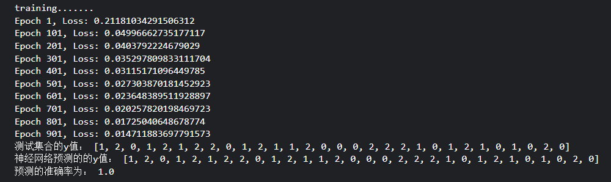

# 
 lab2_report 

## 
 PB22111606\_龙涵睿 

### 1.运行结果

- 基于 sklearn 框架的运行结果（特征分布图是自己加的）
  
- 基于助教框架的运行结果
  

由结果可知：

> TA >= sklearn is True

### 2.实验用时

我是在 kaggle 的 notebook 上完成的，算上在本地环境的七七八八，大概三四个小时吧

### 3.超参数修改

- sklearn:
  `mlp = MLPClassifier(hidden_layer_sizes=(10,10), max_iter=2000, activation='tanh',solver='adam', alpha=0.005, batch_size='auto'，learning_rate='constant', learning_rate_init=0.01,shuffle=True, random_state=22111606, tol=0.00001, verbose=False)`
- 手动：
  因为补充完代码后只修改了**learning_rate:0.01 -> 0.1**就已经能够跑到**acc==1**了，所以没有增加正则化等，epoch 也是 default——1000，因为数据集是按比例随机划分，所以准确率会在 0.9 以上有所浮动，1 中截图为最佳结果，即一次划分两种方法都是 acc==1

### 4.代码相关

注释都在代码中，此外，因为 readme 里面有助教复现代码运行结果的有关要求，~~所以我用*random_state=22111606*来实现一个可复现的运行结果~~实践发现就算我用了同一个 random_state 也会导致结果出现细微差异，不知道为啥，，，但结果都是在 0.9~0.9333...
`X_train,X_test,Y_train,Y_test=train_test_split(X,Y,train_size=0.8,random_state=22111606)`

### 5.other

一开始不是在 kaggle_nb 上面跑的，而是在本地 envs，但是又`ImportError: cannot import name '__version__' from 'numpy' (unknown location)`,很闹麻，这个 numpy 版本兼容性这么差吗
